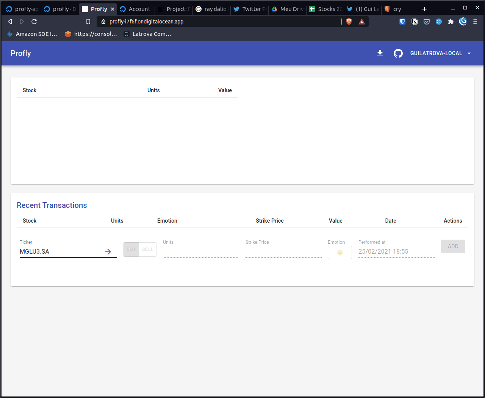
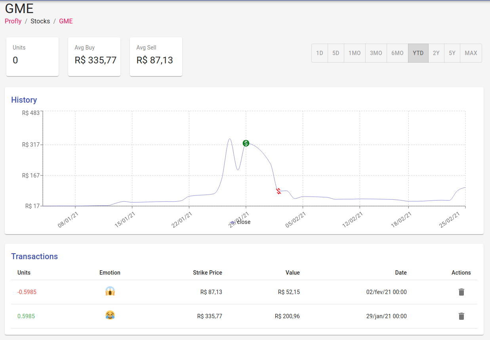
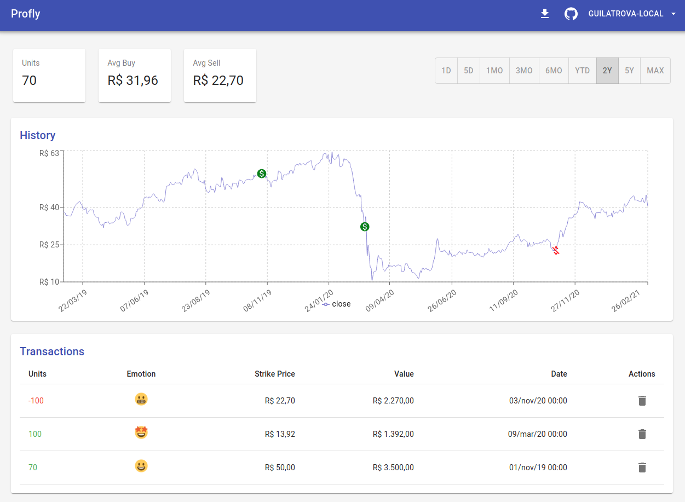

# Profly

Demo: [www.profly.app](https://www.profly.app/)

Post: https://blog.guilatrova.dev/project-profly/

Backend source code can be found here: https://github.com/guilatrova/profly-api

### Purpose

The purpose is to track how much I invested in which stocks (USA and Brazil) and track my emotions as I take actions so I can finetune my decisions, understand why I did what I did, and ultimately learn from my own mistakes.

### Examples

**GME (USA)**

**AZUL (Brazil)**

